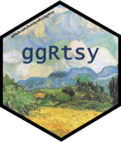
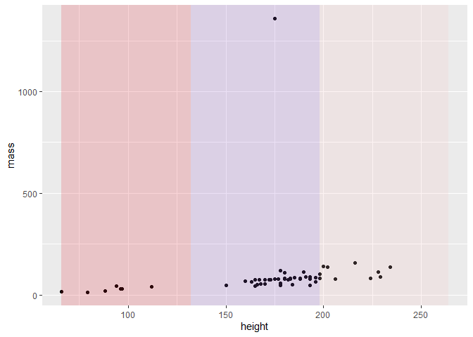
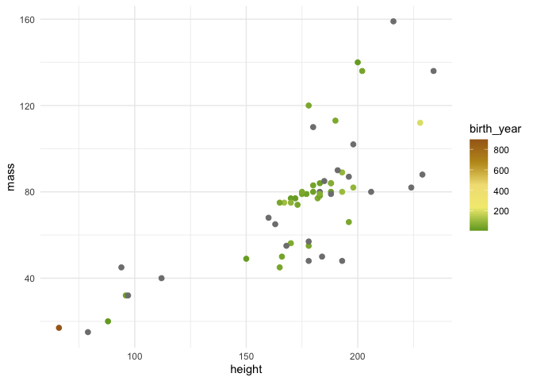
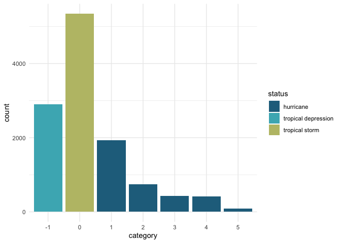

<!-- README.md is generated from README.Rmd. Please edit that file -->

# ggRtsy 

<!-- badges: start -->

[](https://github.com/katelyndiaz/ggRtsy/actions/workflows/R-CMD-check.yaml)
[](https://www.tidyverse.org/lifecycle/#stable)
<!-- badges: end -->

### Overview

The `ggArtsyR()` package works with `ggplot2()` to add an additional
color palette to the user’s repertoire. This is the `goghColors`
dataset, which contains the RGB and hex codes of colors picked from Van
Gogh paintings. It has been broken down into an easy-to-use color
palette based on Van Gogh’s most famous paintings, in the
`gogh_palettes_pop` list.

#### Functions within the package:

It also has a function that work alongside `ggplot2()` to create more
interesting data visualizations and add contextual information to the
user’s plots.

-   `RectangleFiller()` - divides data visualizations into a specified
    number of colored quadrants based on the number of input colors,
    improving the readability of graphs.

-   `scale_color_gogh()` - used to color the point/lines of your ggplot

-   `scale_fill_gogh()` - used to fill the inner color/bars of your
    ggplot

### Usage example

Using Hex Codes from the dataset `goghColors`, three colors were added
on top of a `ggplot` sample scatter plot. Based on the plot, the
function automatically calculated three equal widths of the rectangles,
and stretched them to upper and lower bounds on the y-axis.

``` r
RectangleFiller(plotExample, c("#e32636", "#9966cc", "#f4c2c2"))
```

<!-- -->

#### Continuous `scale_color_gogh` example using the `cafeTerrace` color palette:

``` r
 ggplot(exampleData, aes(x = height, y = mass, color = birth_year)) +
   geom_point(size = 3) +
   scale_color_gogh(palette = "cafeTerrace", discrete = FALSE, reverse=TRUE) +
   theme_minimal()
```

<!-- -->

#### Discrete `scale_fill_gogh` example using the `almondBlossoms` color palette:

``` r
ggplot(storms, aes(x = category, fill = status)) +
  geom_bar() +
  scale_fill_gogh(palette = "almondBlossoms", discrete = TRUE, reverse=FALSE) +
  theme_minimal()
```

<!-- -->

This package also comes with `rgbToHex`, converting rgb colors into hex
code colors.

``` r
rgbToHex(c("(225, 104, 39)","(60, 90, 202)"))
#> [1] "#e16827" "#3c5aca"
```

### Installation instructions

Get the development version from GitHub:

``` r
#Install remotes if needed:
#install.packages("remotes")
remotes::install_github("katelyndiaz/ggRtsy")
```

And load it with

``` r
library(ggRtsy)
```

### Palettes

`starryNight` = ‘\#23338C’, ‘\#30478C’, ‘\#5377A6’, ‘\#BDBF7E’,
‘\#BFA72C’


`sunflowers` = ‘\#74A629’, ‘\#F2EB80’, ‘\#F2E085’, ‘\#BF9821’,
‘\#A6681C’


`selfPortrait` = ‘\#021F59’, ‘\#63A5BF’, ‘\#8C701C’, ‘\#BF9B6F’,
‘\#730202’


`wheatField` = ‘\#73A9D9’, ‘\#477332’, ‘\#D9B13B’, ‘\#D98E32’,
‘\#A66329’


`cafeTerrace` = ‘\#2A6BBF’, ‘\#3F6CA6’, ‘\#F2C84B’, ‘\#D99036’,
‘\#BF6734’


`rhoneStarry` = ‘\#073359’, ‘\#27668C’, ‘\#5A98BF’, ‘\#60734D’,
‘\#A3A658’


`irises` = ‘\#415AA6’, ‘\#6382BF’, ‘\#65A67C’, ‘\#8CA653’, ‘\#A66D58’


`almondBlossoms` = ‘\#236E8C’, ‘\#20788C’, ‘\#49B3BF’, ‘\#41BFBF’,
‘\#BDBF75’


### See also

-   [tayloRswift package](https://github.com/asteves/tayloRswift)
